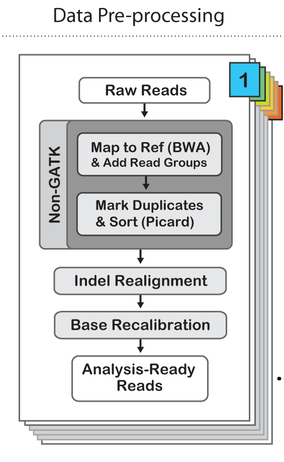

# SNP calling and Filtering

## Programs required
All the programs we will use are available on iceberg through the module system or from the genomics repository

The following programs will be use
    
* samtools v1.2 (available through the module system)
* bcftools v1.3 (available in the genomics repository)
* GATK v3.4 (available through the  module system)

## SNP callers

### Understanding the VCF format

GATK vcf file 

### SAMTOOL/BCFTOOLS

    bash scripts/samtools_snp_calling.sh

### GATK

    bash scripts/gatk_snp_calling.sh 
   
### Comparing the output from different callers

Count the number of variants in the vcf file.

    zgrep -cv ^# vcf_files/gatk.chrLGE22.raw.snps.indels.vcf.gz 
    zgrep -cv ^# vcf_files/samtools.chrLGE22.raw.snps.indels.vcf.gz 

### ANGSD (SNP calling and Popgen analysis in low coverage data)

## Filtering SNPs

Link to file on filtering used in population genomic studies in birds

### Depth filters

### Base qualities, Strand Biases

### Region Filters

## GATK recommended Hard Filters

## SFS

Comparing sfs

